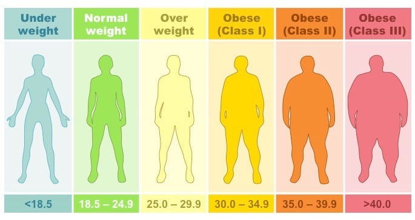

# Obesity Risk Prediction using Machine Learning Models

## Overview 💊

Obesity is a significant global health issue, associated with multiple risk factors and chronic diseases. In this project, we explore machine learning techniques to predict obesity risk based on publicly available health data: [Kaggle Competition](https://www.kaggle.com/competitions/playground-series-s4e2). The goal of this project is showing all the process of building a machine learning solution starting from the data analysis and finishing with the deployment of it.

## Problem Statement

The challenge is to predict obesity status (multi-class) using features such as age, height, wieght, dieatary and behavioral information. We aim to create a robust model that can assist health authorities in better understanding and controlling obesity-related risks.

## Dataset 📊

- The dataset used for this project is sourced from Kaggle's Playground Series S4E2 competition.
- It includes various features related to individuals' health and lifestyle.

## Model Selection

We explore several machine learning methods to predict obesity:

1. **Logistic Regression**: A traditional method for binary classification.
2. **XGBoost**: Alternative based on gradient descendent and Decision Trees.
3. **Random Forest**: A common used algorithm based on Decision Trees.

## Performance Evaluation

- We assess model performance using metrics such as accuracy, precision, recall, and F1-score.
- The Random Forest model shows the highest performance, but we acknowledge moderate concordance between predicted and diagnosed obesity.

## Deployment 🌎

- The deployed service can be accessed at [link](link).

## Environment Setup ⚙️
